# mahjong
- pygame으로 만든 리치마작
- pygame‑1.9.3‑cp36 버전으로 작성

- - -

### 1. 미구현
```
1. AI
2. 후리텐
3. 리치봉
4. 음성
5. 기보 기록, 리플레이
```

### 2. 개선점
```
1. 그래픽
2. 코드 최적화
3. 창 크기 조절
```

### 3. 버그
```
1. 울면 마지막 패가 벌어져서 출력됨
```

---

## 이미지
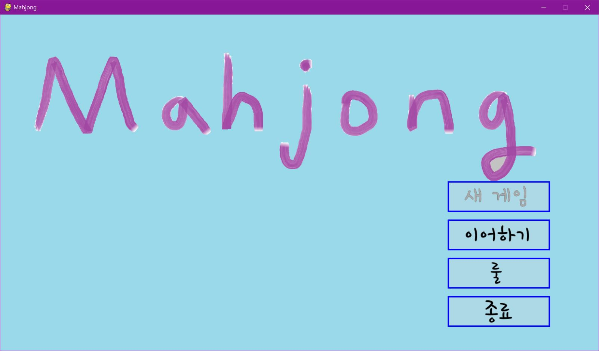

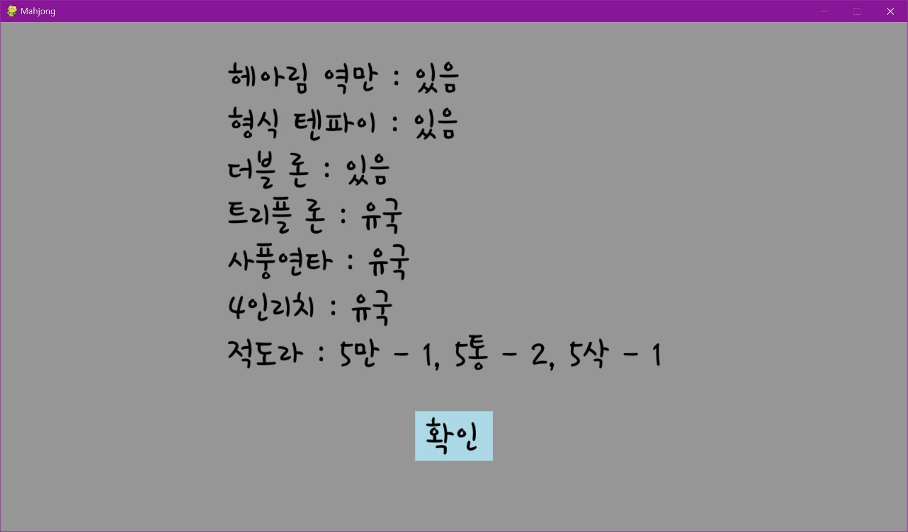
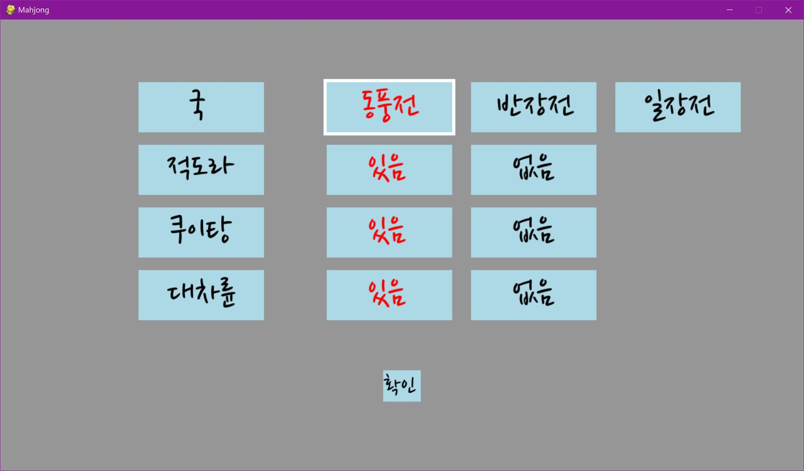

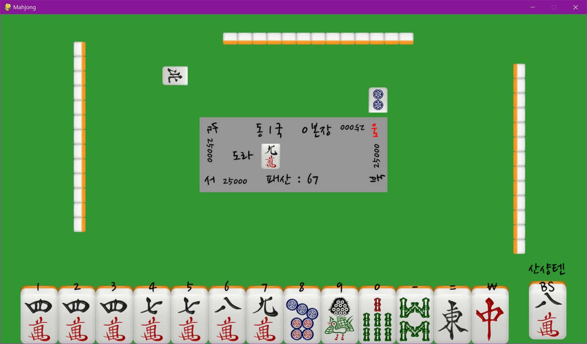
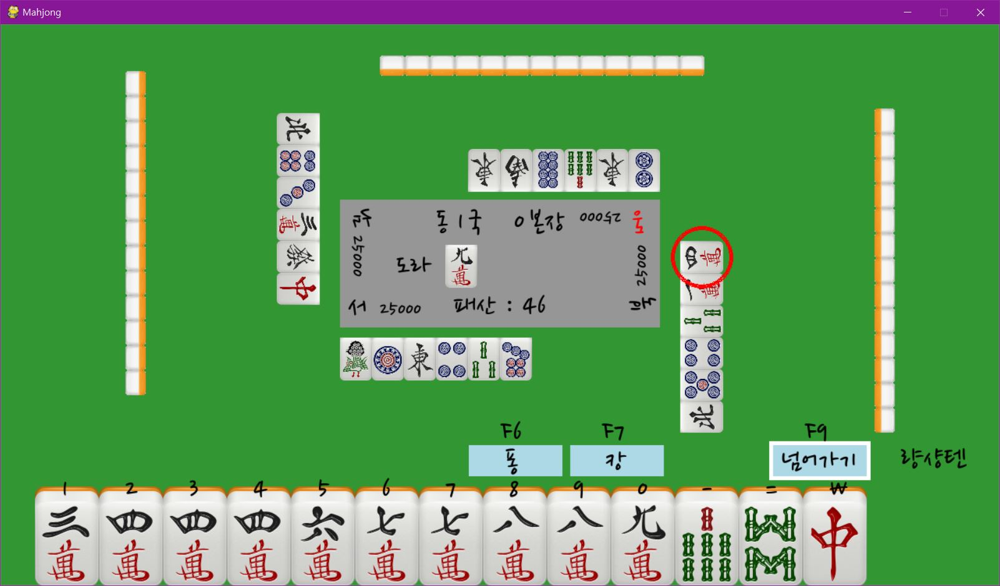
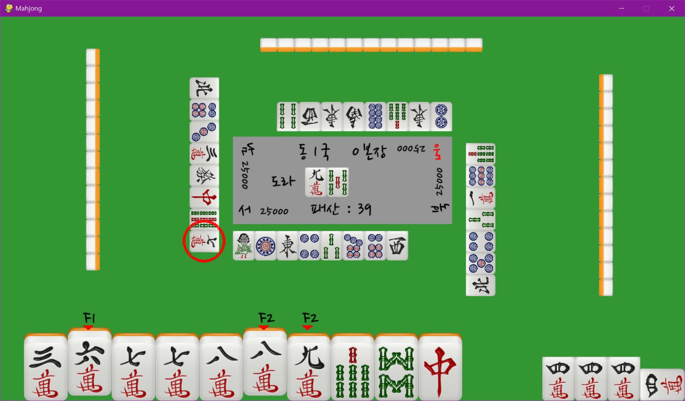
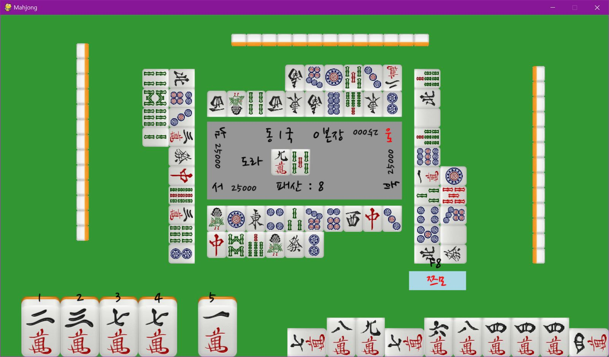
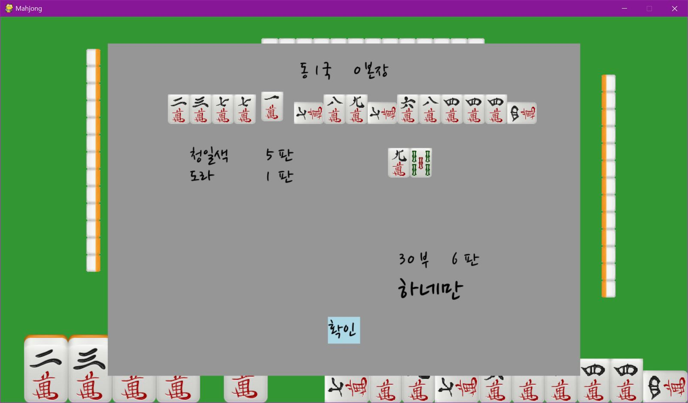
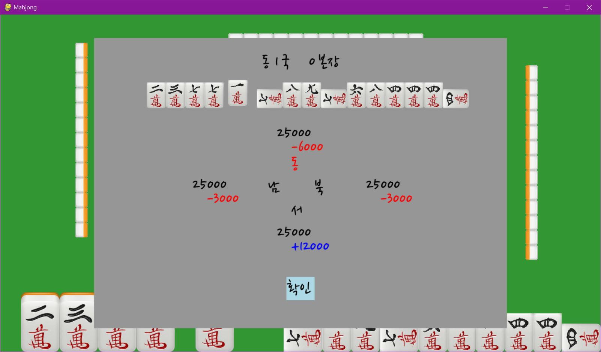
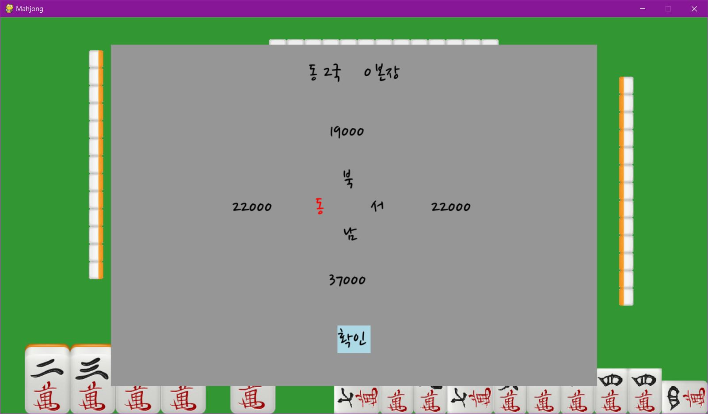
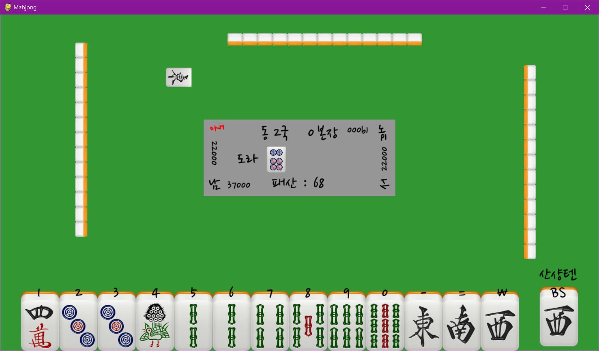

- - -

### ※출처※
1. 마작패 사진
> - http://www.martinpersson.org/wordpress/2010/10/free-mahjong-icons/
